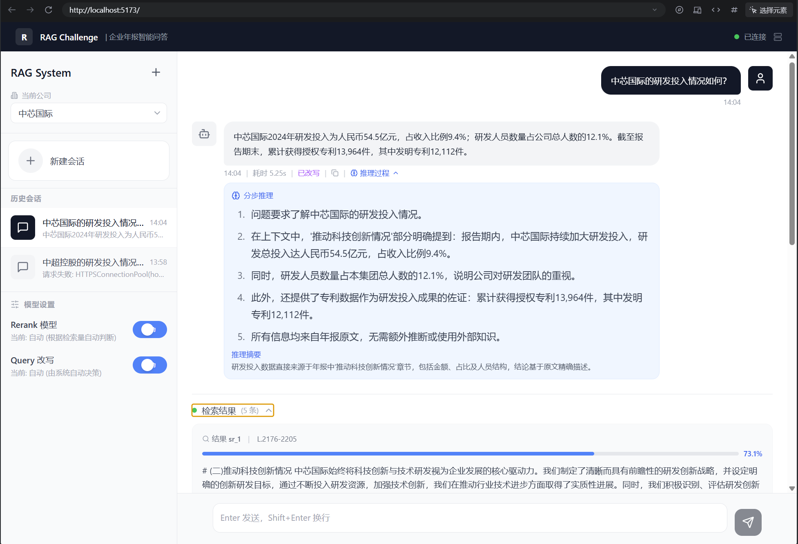

# FinRAG Pro - 企业智能问答系统

基于检索增强生成（RAG）技术的企业知识库智能问答系统，专门用于企业年报等文档的智能问答。

## UI 展示



## 功能特性

- 📄 **智能文档解析**：使用 Docling 实现高质量 PDF 解析，支持表格、图片等复杂内容提取
- 🔍 **混合检索**：结合 BM25 关键词检索与 FAISS 向量检索，提升召回准确率
- 📝 **查询改写**：通过 LLM 智能改写用户问题，优化检索效果
- 🎯 **增强重排序**：对检索结果进行二次排序，确保最相关内容优先
- 🤖 **多模型支持**：支持通义千问、OpenAI、Gemini 等多种大模型
- 💬 **流式对话**：提供自然的对话式交互体验
- 🏢 **多企业支持**：支持同时管理多个企业的知识库

## 技术栈

- **后端框架**：FastAPI
- **向量数据库**：FAISS
- **大模型**：通义千问 (Qwen) / OpenAI / Gemini
- **PDF 解析**：Docling
- **前端框架**：React + TypeScript
- **重排序**：BM25 + 自定义重排序算法
- **文本切分**：智能分块策略

## 项目结构

```
RAG-cy/
├── api_server.py              # FastAPI 后端服务入口
├── app_streamlit.py          # Streamlit 演示应用
├── add_new_company.py        # 添加新企业脚本
├── src/
│   ├── api_requests.py       # 多 LLM API 封装
│   ├── pipeline.py           # 核心流程编排
│   ├── questions_processing.py  # 问题处理核心逻辑
│   ├── retrieval.py          # 向量检索模块
│   ├── query_rewriter.py     # 查询改写模块
│   ├── enhanced_reranker.py  # 增强重排序模块
│   ├── ingestion.py          # 数据摄入模块
│   ├── text_splitter.py      # 文本切分模块
│   ├── pdf_parsing.py        # PDF 解析模块
│   ├── reranking.py          # 重排序模块
│   ├── prompts.py            # Prompt 模板
│   └── tables_serialization.py  # 表格序列化
└── data/
    └── stock_data/           # 企业知识库数据
```

## 快速开始

### 环境配置

1. 克隆项目
```bash
git clone https://github.com/GC-9527/FinRAG-Pro.git
cd FinRAG-Pro
```

2. 安装依赖
```bash
pip install -r requirements.txt
```

3. 配置环境变量

创建 `.env` 文件并添加：
```env
DASHSCOPE_API_KEY=your_dashscope_api_key
# 可选：其他模型 API Key
# OPENAI_API_KEY=your_openai_key
# GEMINI_API_KEY=your_gemini_key
```

### 启动服务

1. 启动后端服务
```bash
python api_server.py
```

后端服务将在 `http://localhost:8000` 启动

2. 启动前端（在另一个终端）
```bash
cd ../构建RAG项目前端代码
npm install
npm run dev
```

前端服务将在 `http://localhost:5173` 启动

## 使用说明

### 添加新企业知识库

1. 准备企业年报 PDF 文件
2. 运行添加脚本：
```bash
python add_new_company.py
```

3. 按照提示输入企业信息和 PDF 路径

### API 接口

#### 健康检查
```
GET /api/health
```

#### 获取企业列表
```
GET /api/companies
```

#### 流式问答
```
POST /api/chat/stream
Content-Type: application/json

{
  "question": "中超控股的研发投入情况如何？",
  "company_name": "中超控股",
  "use_query_rewrite": true,
  "use_enhanced_reranker": true
}
```

#### 获取配置
```
GET /api/config
```

#### 更新配置
```
POST /api/config
Content-Type: application/json

{
  "use_query_rewrite": true,
  "use_enhanced_reranker": true
}
```

## 核心模块说明

### 1. 数据摄入 ([ingestion.py](src/ingestion.py))
- PDF 文档解析与文本提取
- 智能文本切分
- 向量索引构建

### 2. 检索模块 ([retrieval.py](src/retrieval.py))
- BM25 关键词检索
- FAISS 向量检索
- 父文档检索策略

### 3. 查询改写 ([query_rewriter.py](src/query_rewriter.py))
- 问题理解与分类
- 智能改写优化
- 多轮对话上下文处理

### 4. 增强重排序 ([enhanced_reranker.py](src/enhanced_reranker.py))
- 检索结果融合
- 相关性重排序
- 冗余过滤

### 5. 问题处理 ([questions_processing.py](src/questions_processing.py))
- RAG 上下文构建
- LLM 答案生成
- 结构化输出解析

## 配置说明

在 [pipeline.py](src/pipeline.py) 中可以配置：

- `use_query_rewrite`：是否启用查询改写
- `use_enhanced_reranker`：是否启用增强重排序
- `answering_model`：使用的 LLM 模型
- `parent_document_retrieval`：是否使用父文档检索

## 开发说明

### 添加新的 LLM 支持

在 [api_requests.py](src/api_requests.py) 中扩展 `BaseDashscopeProcessor` 或添加新的 Processor 类。

### 自定义 Prompt

在 [prompts.py](src/prompts.py) 中修改或添加 Prompt 模板。

### 测试

运行自动化测试：
```bash
python test_core_audit.py
```

## 性能优化建议

1. **向量检索**：使用 GPU 加速 FAISS
2. **PDF 解析**：Docling 支持 GPU 加速，建议使用
3. **批量处理**：使用并行处理加速文档摄入
4. **缓存策略**：对频繁查询结果进行缓存

## 常见问题

**Q: 如何切换使用的大模型？**

A: 在 [pipeline.py](src/pipeline.py) 或通过前端配置页面修改 `answering_model` 参数。

**Q: 如何提高检索准确率？**

A: 建议同时启用查询改写和增强重排序功能，并确保文档切分质量。

**Q: 支持哪些格式的文档？**

A: 当前主要支持 PDF 格式，可扩展支持 Word、PPT 等格式。

## 许可证

MIT License

## 贡献

欢迎提交 Issue 和 Pull Request！
